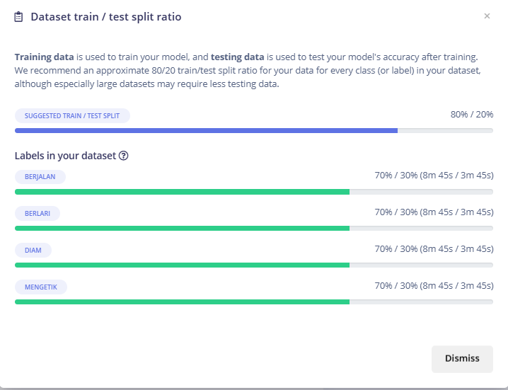
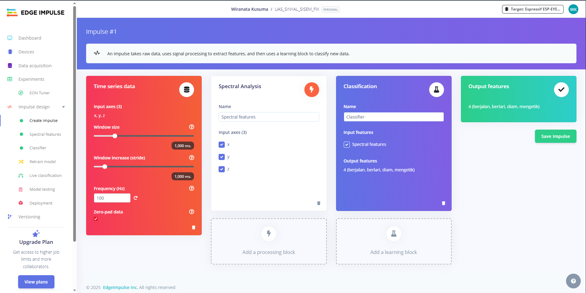
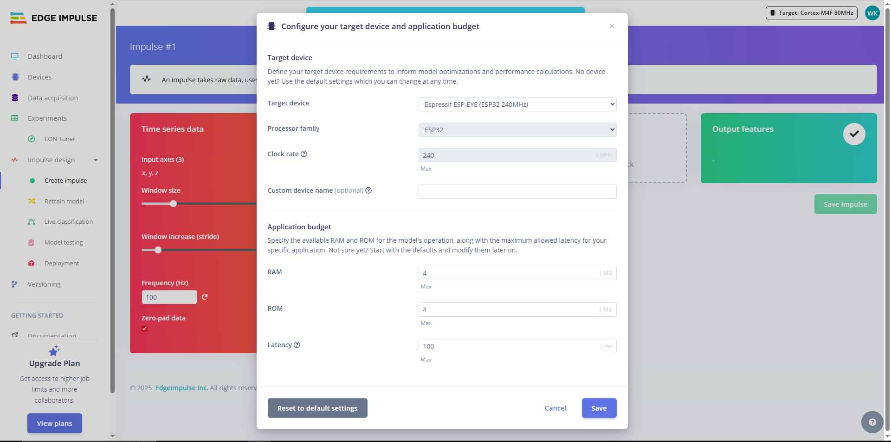
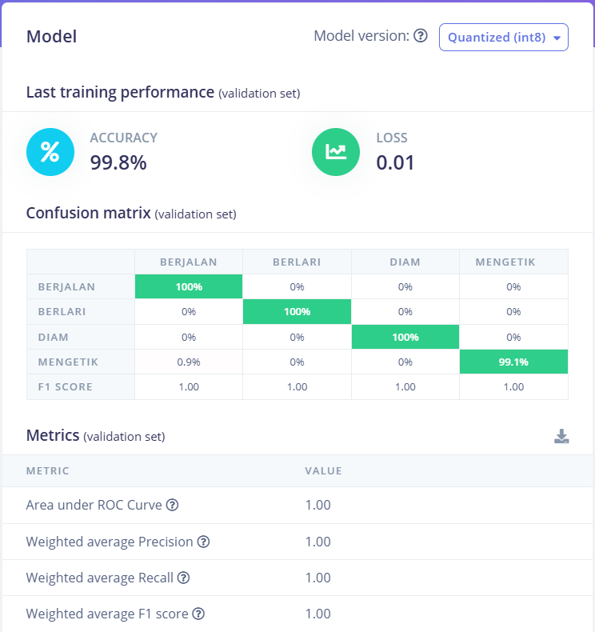

# Klasifikasi Gerakan Tangan Menggunakan Sensor Akselerometer Berbasis Tinyml Dengan Edge Impulse

Sistem klasifikasi aktivitas tangan (mengetik, berjalan, berlari, diam) secara real-time menggunakan sensor akselerometer **MPU6050**, mikrokontroler **ESP32**, dan platform **Edge Impulse**. Proyek ini memanfaatkan **TinyML** untuk menjalankan inferensi langsung di perangkat ESP32.

## Fitur

- Inferensi real-time langsung di ESP32 tanpa internet
- Output klasifikasi ditampilkan pada OLED 0.96"
- Indikator LED menyala saat aktivitas *berlari* terdeteksi

## Aktivitas yang Diklasifikasikan

- Diam
- Mengetik
- Berjalan
- Berlari

## Komponen Hardware

| Komponen            | Jumlah | Keterangan                          |
|---------------------|--------|-------------------------------------|
| ESP32               | 1      | Mikrokontroler utama                |
| Sensor MPU6050      | 1      | Akselerometer & gyroscope 3-axis   |
| microSD + Modul microSD     | 1 set  | Penyimpanan dataset CSV            |
| OLED 0.96"          | 1      | Output hasil klasifikasi            |
| Baterai 3.7V + Charger | 1    | Catu daya               |

## Tools & Platform

- [Edge Impulse](https://www.edgeimpulse.com/) – Training & deployment TinyML
- [Arduino IDE](https://www.arduino.cc/en/software) – Upload kode ke ESP32
- [MicroPython](https://micropython.org/) – Logging data sensor ke SD Card
- [Thonny IDE](https://thonny.org/) – Program MicroPython

## Instalasi & Setup

### 1. Mengakuisisi Data (MicroPython)
- Membuat rangkaian seperti gambar dibawah
  
- Membuat case yang kompatibel dan tidak menggangu aktivitas pengguna seperti gambar dibawah
  
  
  Penggunaan:
  
  
- Menggunakan script `main.py` (lihat `/micropython/`) untuk merekam data selama 5 detik @100Hz (500 sampel)
- Pastikan data disimpan ke SD Card dalam format `.csv`

### 2. Pelatihan Model dengan Edge Impulse
- Mengupload dataset dengan CSV wizard ke Edge Impulse
  
- Split dataset menjadi 70% train dan 30% test untuk hasil yang lebih baik
  
- Membuat Impulse baru sesuai dengan properti dibawah
  (Window size = 1000ms dan Window increase = 1000ms, Processing Block=Spectral Analysis)
  
- Memilih target device pada ESP32-EYE atau bisa disesuaikan
  
- Pada tab Spectral Feature menggunakan nilai default dari Edge Impulse
  
- Pada tab Generate Feature menggunakan nilai default dari Edge Impulse
  
- Pada Classifier tab Menggunakan Spectral Features + Neural Network (2 hidden layers)
  
- Konversi model menjadi library Arduino pada tab Deplyment `.zip`

### 3. Inferensi di ESP32 (Arduino IDE)
- Import library dari Edge Impulse
- Gunakan kode `main.ino` untuk membaca akselerometer dan menampilkan hasil klasifikasi

## Hasil Pelatihan Model
  
  
- **Akurasi Validasi**: 99.8%
- **Latency Inferensi**: 1 ms
- **RAM Usage**: 1.4 KB
- **Flash Usage**: 15.3 KB

## Tampilan Sistem

| Tampak Luar | Tampak Dalam |
|-------------|--------------|
|  |  |

## Kontributor
- I Putu Gede Sastra Ary Wirasana
- I Made Wiranata Kusuma Putra
- Muhammad Raihan Mufti

## Lisensi

Proyek ini menggunakan lisensi [MIT License](LICENSE) – silakan digunakan dan dimodifikasi secara bebas untuk pembelajaran atau pengembangan lebih lanjut.

---

